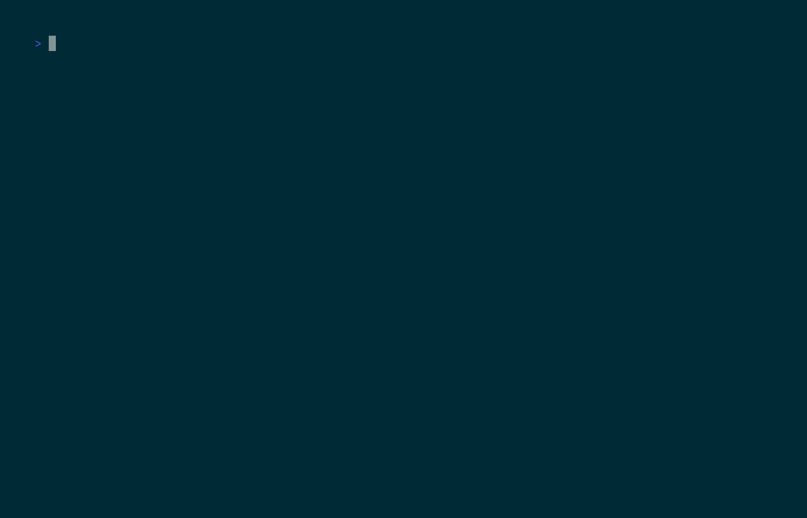

# roast-my-code


The AI that roasts your codebase so your teammates don't have to.

## Install

PyPI release is pending. Install from source for now:

```bash
git clone https://github.com/Rohan5commit/roast-my-code
cd roast-my-code
pip install -e .
```

## Free LLM Setup (Recommended)

Use Groq as primary (free tier), and NVIDIA NIM as backup.

```bash
export GROQ_API_KEY="your-groq-key"
export NVIDIA_NIM_API_KEY="your-nim-key"
```

Default model choices in this project:
- Primary: `llama-3.3-70b-versatile` (Groq)
- Backup: `microsoft/phi-4-mini-instruct` (NIM)

## Usage

```bash
roast ./my-project
roast https://github.com/user/repo
roast ./my-project --no-llm --output report.html
```

Provider controls:

```bash
roast ./my-project --provider groq --model llama-3.3-70b-versatile
roast ./my-project --provider auto --backup-provider nim --backup-model microsoft/phi-4-mini-instruct
```

## Demo



_Recorded with VHS._

## Famous Repo Roasts (2026-02-28)

- [requests HTML report](./famous-roasts/2026-02-28/requests/requests.html)
- [django HTML report](./famous-roasts/2026-02-28/django/django.html)
- [flask HTML report](./famous-roasts/2026-02-28/flask/flask.html)

## Contributing

Contributions are welcome. Open an issue for bugs/ideas, then submit a PR with tests for behavior changes.